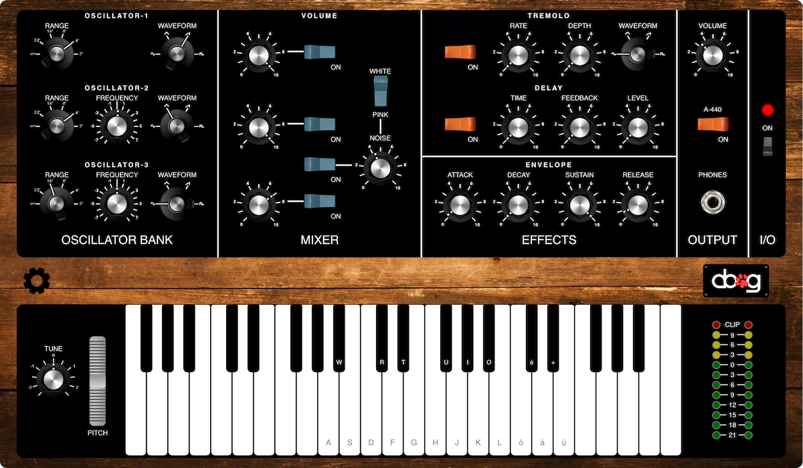

# Web-Synth 
## Web-based emulation of a classic: Mini Moog Model D

## Introduction
As a project for the Advanced Coding Tools and Methodologies course we developed a Javascript-powered emulation of one of the most famous synthetizer of all the time: the Mini Moog Model D. We chose this model because it's literally a masterpiece in electronic music production history, and we also find interesting how the synth works and how it produces those sounds that can be heard in so many famous recordings from the 70s to nowadays. It runs entirerly in your browser, so it's totally cross-platform and available for every desktop OS. Based on the latest WebAudio APIs, our synthetizer can be controlled directly with the keyboard of your PC, or with external MIDI keyboard(s). Every knob of the UX can be assigned to 3 different physical potentiometers, managed by an Arduino Board. With the dedicated Android App you can also control pitch bending and sustain moving your smartphone.  

## Mini Moog Model D History

> All the sounds you've ever heard are like a second. the Moog is an Eternity. Seclude yourself now and let the music sweep you away and into the dawn. Seek to become newly aware of yourself, the world of nature around you, the people near you. And if you feel it, express yourself

David Van Koevering, 1971

*Created in 1970, the Minimoog Model D is the instrument that brought the synthesizer out of
the university laboratories and recording studios and placed it in the hands of on-stage musicians around the world. Unlike the larger modular synthesizers of the day, the Minimoog Model D could be played instantly, with no cable-patching between modules. Everything the performer needed was right there on the panel. In fact, the true genius of the Minimoog Model D was the front panel design. By grouping together related components—Controllers, Oscillators, Modifiers, etc.—the front panel became a flowchart that made audio synthesis simple to understand. The Minimoog Model D was quickly embraced by a diverse roster of performers touching nearly every genre of music. In just over a decade, well over 10,000 Minimoog Model D synthesizers were sold worldwide. Today, the Minimoog Model D remains one of the most coveted of all synthesizers.*

## Moog Technology
The MiniMoog has three indipendent Oscillators, a Noise Generator and an External Audio Input. The Oscillators has a frequency range from 0.1 to 20 kHz (In Six Overlapping Ranges), with several different waveforms: Triangle, Triangle-Sawtooth, Reverse Sawtooth, Sawtooth, Rectangle, Wide Pulse and Narrow Pulse. As usual in analog synthesizers, each set of circuits performs a particular job; each oscillator, filter, and contour generator is a self-contained module. The Minimoog Model D connects these modules together internally using both audio signals and control signals. Audio signals are the sounds you hear emanating from the sound creation circuits of the instrument. Control signals modify the settings of these circuits by providing a continuously variable control voltage—the foundation of the voltage controlled synthesizer. So the sounds are made with Voltage-Controlled Oscillator, or VCO for short, that have a Control Voltage (CV) input.  The pitch of the wave produced by the VCO goes up and down in response to the CV it is supplied with. The oscillators have to be in tune, so they must change pitch by a known amount given a certain change in voltage.  To facilitate this, there are several different control voltage “standards” like Volts per Octave (each volt equals 1 octave, used in the Moog Synths) and Hertz per Volt. 

An additional type of control signal is known as a Gate or V-Trigger, which is simply used to initiate an event. For example, playing a note on the keyboard sends a control voltage to the Oscillators to change the pitch, and also sends a gate signal to trigger the Loudness Contour and Filter Contour generators. Oscillators are the primary source of sound in an analog synthesizer. The Minimoog Model D Oscillator Bank contains three nearly identical Oscillators. This arrangement means each key can sound up to three oscillators each with its own Waveform, Octave, and Pitch setting—creating a deep or complex sound.

## User Interface
The Mini Moog is packed with features, but still has a very simple and straightforward interface, turn the Synth on, choose a preset and you're ready to play with a great sound! Otherwise you can create a sound from scratch setting up the oscillators, mixing them and finally adding some effects like tremolo or delay. In the following paragraphs we will in detail every section of the UI. 

### KeyBoard - Tune & Pitch Wheel

1. **Preset Button:** click here to see the list of available presets
2. **Tune:** this knob let you transpose the keyboard up to a fourth interval, up or down, one semitone for each step 
3. **Pitch:** the classic pitch wheel, with this slider you can "bend" in a continuos way the note you're playing up or down
4. **Keyboard:** standard 44-keys keyboard, you can play it clicking on the keys or by pressing the letters related to the keys as shown
5. **Meter:** simple but useful meter to keep under control the output level in order to avoid clipping  

### Oscillator Bank

1. **Range:** this 6-step knob let you choose the octave of the oscillator, on OFF position you have the standard octave, then for every step from 2' to 32' the sound goes down one octave
2. **Waveform:** use this to select the waveform of the relative oscillator, you can choose among the following: Sine - Triangular - Sawthoot - Square 
3. **Frequency:** this is a detuner, can go up or down from 1 to 8 semitones, it's useful to create armonies and chords with different oscillators (you can add a fourth below or a fifth above to your main sound for example)

### Mixer

1. **Oscillators Volume:** use this knobs to control the level of the oscillators
2. **On/Off Switch:** turn on or off the relativa oscillator
3. **White/Pink Noise:** with this switch you can choose between white and pink noise, while the first has a spectrum constant in magnitude, the magnitude of the second decreases above a certain frequency
4. **Noise Level:** adjusts the noise level

Some tips: noise is great when it comes to give "life" to a synthetic sounds, but its level must be low! 

### Envelope

1. **Attack:** controls attack time
2. **Decay:** controls decay time
3. **Sustain:** controls sustain time
4. **Release:** controls release time

### Effects

#### Tremolo

*Tremolo, in electronics, is the variation in amplitude of sound achieved through electronic means, sometimes mistakenly called vibrato, and producing a sound somewhat reminiscent of flanging, referred to as an "underwater effect".*

1. **On/Off Switch:** turn on and off the tremolo
2. **Rate:** controls the frequency of the LFO, so the "speed" at which the volume oscillates (the LFO operates at frequencies beetween 1 and 10 Hz)
3. **Depth:** controls the depth of the effect, at higher setting you will hear a more pronounced oscillation of the volume
4. **WaveForm:** sets the waveform of the LFO, you can choose among the following: Sine - Triangular - Sawthoot - Square

#### Delay

*Delay is an audio effect or an effects unit which records an input signal to an audio storage medium, and then plays it back after a period of time. The delayed signal may either be played back multiple times, or played back into the recording again, to create the sound of a repeating, decaying echo.*

5. **On/Off Switch:** turn on and off the delay
6. **Time:** controls the time between the repetitions, set low for a "slapback" kind of sound, or high for a fuller sound
7. **Feedback:** controls the number of repetitions, use a short feedback and a high level to get the "slapback" sound mentioned before
8. **Level:** controls the volume of the first repetition, then the decay is controlled by the feedback level

### Output

1. **Master Volume:** controls the overall output level of the synth
2. **A-440:** this switch let you play a simple sinusoid at 440 Hz (A), it's used to test the output level
3. **On/Off Switch:** master power switch, you have to turn this switch on in order to use the synth

### Presets

1. **Church:** the sound of a classic church organ, full and round
2. **Hammond:** one of the most famous organs of all time: the Hammond! It has a very smooth and rich sound, ideal for blues and jazz
3. **Sub Bass:** ideal for bass lines in disco/electronic music, this sound has powerful and thight bass frequencies
4. **Jump:** Van Halen in 1984 released "Jump", with a synth riff that became instantly a classic. This preset aims at recreating that iconic sound from the 80s 
5. **Videogame:** a very "retrò" and "8-bit" style sound, inspired by the videogames of the 80s like pac-man
6. **Star Wars:** *"A long time ago in a galaxy far, far away..."* this sound is inspired by the opening music of "Star Wars"
7. **UFO:** a very strange and weird sound, like the ones you ususally hear in films about aliens

## Technologies Used

### HTML, CSS & JS

Ous synth is a web application, so it's based on HTLM,CSS and JS code. With HTML we manage the structure of the interface, while the CSS files contain the information about the style of every section of the UI, starting from the background to the fonts and the colours. All the knobs are made with JKnobman, a simple program that let you design your custom knob and export it in PNG (then we rotate them from -135° to 135° with a CSS transformation). Javascrip play an important role, mainly with the WebAudio APIs described below, but also for all the functions related to clicks, drags and rotations made by the user with the mouse/trackpad.

### Web Audio API

Sounds and effects of our project are powered by the modern WebAudio APIs (you can learn more about them [here](https://developer.mozilla.org/it/docs/Web/API/Web_Audio_API)). In detail we used the libraries related to oscillators, gains and delays. Here's a brief description on how this APIs works:

>The Web Audio API involves handling audio operations inside an audio context, and has been designed to allow modular routing. Basic audio operations are performed with audio nodes, which are linked together to form an audio routing graph. Several sources — with different types of channel layout — are supported even within a single context. This modular design provides the flexibility to create complex audio functions with dynamic effects.

### MIDI

Playing a synth with a PC keyboard is a bit uncomfortable, for this reason our synth can work with any external MIDI keyboard, and it's extremely simple! All you have to do is to connect your MIDI Keyboard with a USB cable to your PC (only Google Chrome support this feature). Any MIDI device sends MIDI messages in a specific format (you can learn more about it [here](www.midi.org)), and we interpret each message in JS, in order to perform the related action (play a note, bend the pitch, change volume etc...). 
In particular we use three bytes of the message:
1. **STATUS BYTE:** indicates the type of message, for example "note on", "note off", "control change" etc...
2. **NOTE:** the note that has to be played or the control that has to changed (for example pitch wheel, master volume etc...)
3. **VELOCITY:** the value transmitted, for a note is the force applied to the key (strictly related to the volume of the resulting note played), for other messages is the new value that has to be applied to the specific control.

We used standard MIDI control change messages for pitch wheel, sustain and master volume, while for the other features we otherwise preferred custom messages.

### Arduino

We designed a custom circuit managed by an Arduino Board, that gives to the user the possibilty to control 3 parameters of the UI with 3 physical potentiometer. On the circuit there are also 3 buttons and a display, with the first and the last button (up/down buttons) you can cycle through the synth parameters, and select the one you want pressing the central one, on the display you will see the name of the parameters and, while playing, a nice animation with stylized music notes. Arduino, like a MIDI device, exchange via USB MIDI messages with the PC, the format of these messages is the same described before. If you want to use both Arduino and an external MIDI Keyboard you have to follow few simple passages to set up everything, there's a little guide below.

1. **Down Button**
2. **Confirm Button**
3. **Up Button**
4. **Display** 
5. **Pot 3**
6. **Pot 1**
7. **Pot 2**

### Android

We developed a custom Android Application that reads data from the gyroscope/accelerometer/magnetometer of the smartphone and sends them in MIDI messages via USB to the pc. In this way you can control pitch bend and sustain moving your smartphone. In "Pitch Wheel" mode the angular acceleration of the smartphone controls pitch bending on the synth, while in "Sustain" mode the angle determines if sustain is on or off (you can for example fix your smartphone on your foot and engage sustain moving it like on a real piano/synth with a dedicated pedal).

1. **Pitch Wheel Button:** tap on this button to control the pitch wheel
2. **Sustain Button:** tap on this button to control the sustain

### Surge

Our project is availabe to everyone thanks to Surge. Surge is a platform that let you publish online a web site/app for free in an extremely simple way.

>Surge: Static web publishing for Front-End Developers. Simple, single-command web publishing. Publish HTML, CSS, and JS for free, without leaving the command line.

Try out our web synth! Link: --> [Web-Synth](http://websynth.surge.sh/) <--  

## How to Use

### Web-Only

You can use our Mini Moog directly with the PC keyboard, the keys from "A" to "ù" are mapped to the notes from A 440 Hz to to the E of the octave above, use the "Tune" knob to shift the notes range below or above.

### With External MIDI KeyBoard

In order to use an external MIDI Keyboard you simply have to connect it with an USB cable, it's totally plug'n play!

### With ARDUINO

You can use an Arduino Board connected to a simple circuit to control the synth parameters. Arduino sends MIDI messages to the synth, so you have to use Hairless MIDISerial to manage its MIDI messages and the ones coming from other sources like MIDI Keyboard at the same time. 

#### Arduino First Set Up 

1. Download and Install Arduino IDE from [here](https://www.arduino.cc/en/Main/Software)
2. Build the circuit on a breadboard and connect it to Arduino as shown in figure
3. Download the sketch ([sketch](https://github.com/Gioelson95/Web-Synth/blob/master/controllerArduino/controllerArduino.ino))
4. Run the sketch and upload it on Arduino ([here](https://www.arduino.cc/en/Guide/HomePage) you can read a detailed guide about this)

#### Arduino MIDI Set Up

> How to set up Hairless MIDISerial

1. Connect Arduino to the PC with an USB cable
2. Run Hairless MIDISerial (download it [here](http://projectgus.github.io/hairless-midiserial/))
3. Select the Arduino port on "Serial Port"
4. Select other external MIDI devices (if connected) on "MIDI In"
5. Select internal MIDI bus on "MIDI Out"

#### Arduino as MIDI Controller
    
1. Connect Arduino, and after a while, if the setup was done correctly, a welcome message will appear
2. Click CONFIRM button to continue
3. Select the paramter you want to control with the first potenentiometer. Use UP and DOWN button to cycle through the list of parameters
4. Click CONFIRM button to continue
5. Repeat steps 3. and 4. for the other two potentiometers
6. When the selection is over, the LED turn on and the controller is ready to work
7. To change parameters, click CONFIRM button to exit from running mode, the LED will turn off
8. Click CONFIRM button to restart the configuration from step 3.	

### With Android App

	

In order to use your Android Smartphone as a controller for pitch bending and sustain simply connect it to your pc with a USB cable, and select "MIDI" as shown in picture above, then run our [app](https://github.com/Gioelson95/Web-Synth/blob/master/WebSynthMidiController/WebSynthController.apk) and select "Pitch" or "Sustain" (the selected option is highlighted in green, the other option, disabled, will be red).

## Video Demo
Here's a short demo of our project --> [Demo](https://youtu.be/8V7RUzdDKRA)

